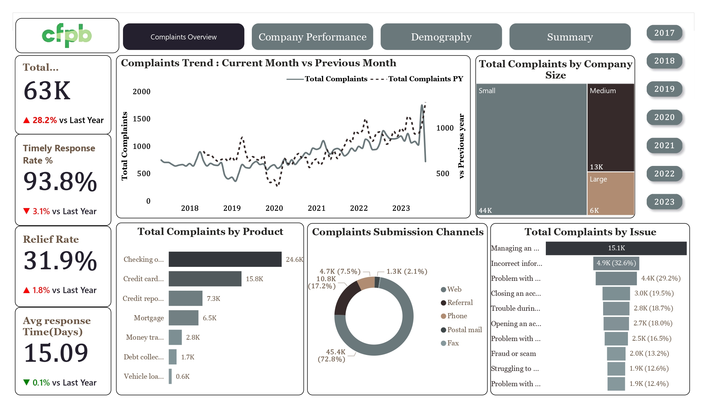

# FP20 Analytics Challenge (CFPB Dataset)

I'm excited to share my FP20 Analytics Challenge 31!
This challenge focused on analyzing Consumer Financial Complaints Data from the Consumer Financial Protection Bureau (CFPB) to uncover insights into performance, responsiveness, and customer satisfaction trends.

🔍 Key Insights 

📈 Total Complaints: 63K (+28.2% YoY) — major rise in consumer issues, possibly due to increased service use or unresolved problems. 
⏱️ Timely Response Rate: 93.8% (↓3.1%) — slight dip in responsiveness.
✅ Relief Rate: 31.9% (↓1.8%) — suggests reduced satisfaction. 
📅 Avg. Response Time: 15.09 days (+0.1%) — stable handling despite growth.

🌐 Submission Channels: 
Web leads with 72.8%, showing strong digital adoption. Physical modes (mail, fax) nearly obsolete. 

📊 Trends (2017–2023): 
Upward pattern with a July 2023 spike (1,749 complaints) — likely service or awareness-driven. 

🏢 Top Companies: 
• COMP-0490 & COMP-0878 → high complaints per market share. 
• COMP-1022 → most efficient with 30.75% share and low complaint rate. 
Most firms maintain >90% timely responses.

🗺️ Geographic Insights: 
High-volume states: CA, FL, TX, NY. 
Best resolution: ID (47.5%) | Worst: GA (25.3%) | Fast but weak: AK (13.3 days / 25.5%).

🧭 Action Plan 
1️⃣ Improve Resolution Quality — Audit GA & FL; adopt ID’s best practices; second-review low-relief fast closures. 
2️⃣ Control Complaint Growth — Investigate July spike; monitor high-risk players (COMP-0490 & COMP-0878); enhance web self-service (72.8% channel).
